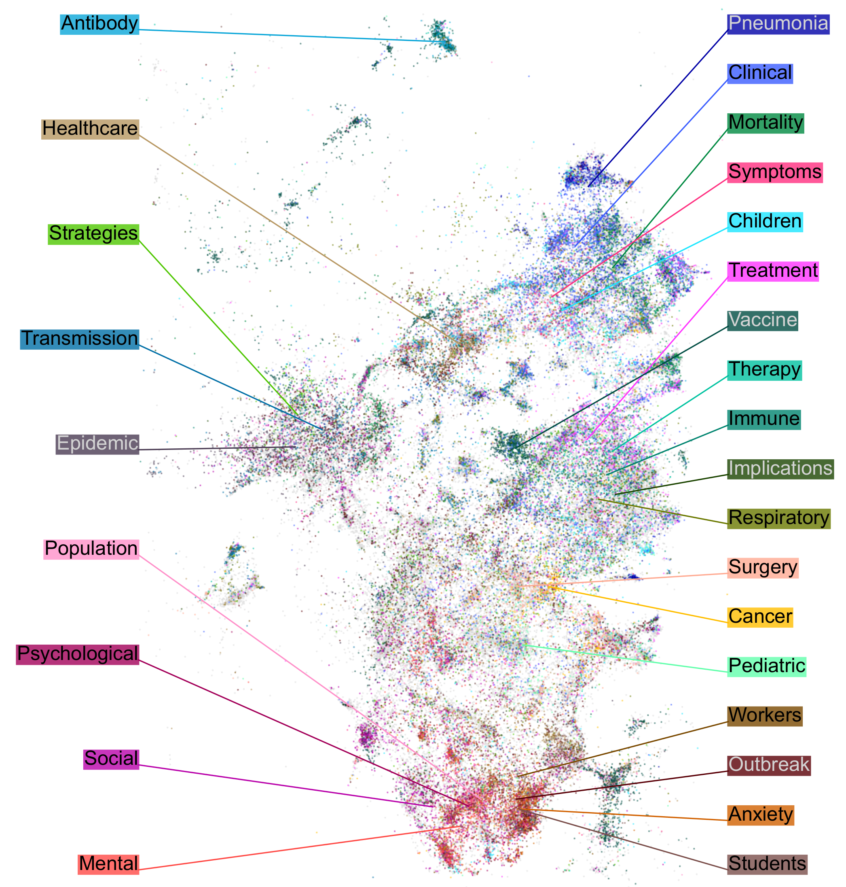

```{r, include=FALSE}
knitr::opts_chunk$set(echo = FALSE, warning = FALSE, message = FALSE, dev='cairo_pdf', fig.align='center', fig.show='hold')
# setwd("/home/agricolamz/work/materials/2023.05.02_HSE_linguistic_bibliometrics")
library(tidyverse)
library(kableExtra)
```

#  Introduction

##  [@gonzalez23] The landscape of biomedical research

> The number of publications in biomedicine and life sciences has rapidly grown over the last decades, with over 1.5 million papers now published every year. This makes it difficult to keep track of new scientific works and to have an overview of the evolution of the field as a whole. Here we present a 2D atlas of the entire corpus of biomedical literature, and argue that it provides a unique and useful overview of the life sciences research. <...>

<https://static.nomic.ai/pubmed.html> (interactive version)

**This is a preprint and has not been certified by peer review!**

##  [@gonzalez23]

```{r, out.width='65%'}
knitr::include_graphics("images/01_landscape.png")
```

2D embedding of the PubMed dataset. Paper abstracts (n = 21 M) were transformed into 768-dimensional vectors with PubMedBERT [@gu21] and then embedded in 2D with t-SNE [@maaten08]. Coloured using labels based on journal titles. Unlabeled papers are shown in gray and are displayed in the background.

##  [@gonzalez23]

```{r, out.width='49%'}
knitr::include_graphics("images/02_landscape_by_year.png")

```

Covid-19 region of the map. Colours are assigned using labels based on paper titles. Unlabeled Covid papers are shown in the background in gray. This region in the embedding also contained some non-Covid papers (~15%) about other respiratory epidemics; they are not shown.

##  [@gonzalez23]

```{r, out.width='43%'}
knitr::include_graphics("images/04_landscape_by_gender.png")
knitr::include_graphics("images/05_education_surgery.png")
```

Papers coloured by the inferred gender of their first authors.(d–e) Regions of the map showing within-label heterogeneity in the distribution of first authors’ gender.

##  Reaction of proffesional doctors and pharmacologist

```{r, out.width='70%'}
knitr::include_graphics("images/06_doctor.jpg")
```

AI generated picture

##  How wonderful would it be to have something like this for linguistics?

- zoning of different subfields of linguistics
- interaction of different subfields of linguistics
    - can we see a boundary between morphology and syntax?
    - can we see cancer-like behavior of the Computer linguistics among all subfields of modern linguistics?
    - can we visualize the emergence of Computer linguistics?
    - can we show how strong/vague are boundaries between philology, Digital Humanity and linguistics?
    - can we visualize the history of linguistics?
    - can we see the scientific track/preferences of different researchers? E. g. if the person is a phonetician will this person also be into the computational linguistics? 
    - ...

##  Plan

- extract abstracts from publications in linguistic journals
- use them in order to create some space of linguistic publications (one dot -- one publication)
- see how linguistic journals are distributed within this space

# Our team

## Our team

- conceptualization: George Moroz, Boris Orekhov
- team leadership: George Moroz, Asya Alekseeva, Kirill Sidorov
- data curation, data analysis: George Moroz
- data gathering and annotation:
    - DH masters: Kirill Sidorov and Artyom Orekhov
    - bachelor students: Asya Alekseeva, Timofei Dedov and Angelina Stepanova
    - group of bachelor students who choose this project as a summer practice (2-week internship)

# Data collection

## Journal lists

We have different journal lists

- Tag `филология, лингвистика, медиакоммуникации` from list of journals HSE uses for Academic Merit Bonus.\footnote[frame]{As far as I know, we are not allowed to disclosure those lists outside the HSE. However, right now they are available without any checks for HSE affiliation.}

```{r, out.width='70%'}
knitr::include_graphics("images/07_hse_journal_list.png")
```

- Tag `6162 Languages` from journal rankings from [Finish Publication Forum](https://www.tsv.fi/julkaisufoorumi/haku.php)

```{r, out.width='45%'}
knitr::include_graphics("images/08_helsenki.png")
```

## Journal lists

After we gathered journal lists we annotated them according to personal beliefs on what is linguistics, and what is not (tags: `linguistics` (232); `interdisciplinary` (203); `language_learning` (26) and some others).

There is also a side-project on annotation of journals for literature science (tags: `literary_studies` (168); `interdisciplinary` (253); `philology` (12) and some others).

```{r}
journals <- readxl::read_xlsx("/home/agricolamz/work/bureaucracy/linguistic_convergency/journals/repo/abcd_list_annotated.xlsx")

linguistics <- journals |> filter(linguistics == "linguistics") |> nrow()
annotated_journals <- journals |> filter(!is.na(linguistics)) |> nrow()
not_annotated_journals <- journals |> filter(is.na(linguistics)) |> nrow()
```

After manual annotation `r linguistics` (`r round(linguistics/annotated_journals*100)`%) journals out of `r annotated_journals` have tag `linguistics`. `r not_annotated_journals` journals have not yet been annotated.

```{r}
journals |> 
  filter(linguistics == "linguistics") |>
  count(hse_level, helsenki_level)  |> 
  pivot_wider(names_from = helsenki_level, values_from = n)  |> 
  rename(`HSE level` = hse_level) |> 
  kable() |> 
  add_header_above(c(" " = 1, "Helsenki level" = 5)) |> 
  kable_styling(position = "center")
```

## Abstracts extraction

>- We planed to scrap all papers' metadata from the journals' web-pages
>- Then we discovered the `crossref` database and the `rcrossref` package [@chamberlain22] for R
>- Then we discovered the `openalex` database and the `openalexR` package [@aria23] for R

## Abstracts extraction: scrapping journal web-pages

Since journals can be grouped by the publishers it is possible to write a web-scrapper for the group of journals from one publisher. However there were some problems:

- blocking the IP address
- a lot of old publication are digitized in the form of a pdf of the first page of the paper
- change of the name and ISSN\footnote[frame]{ISSN (International Standard Serial Number) ---  eight-digit serial number used to uniquely identify a serial publication.} of the journal
- change of the publisher of the journal
- there are still some mistakes on the journal websites

```{r, out.width='60%'}
# https://doi.org/10.1007/BF02743731
knitr::include_graphics("images/09_russian_linguistics.png")
```

# Data analysis

# Conclussions

## {}

\LARGE Thank you for your attention!

# References {.allowframebreaks}