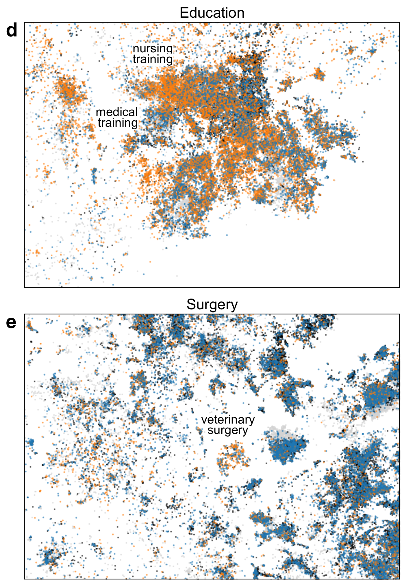

```{r, include=FALSE}
knitr::opts_chunk$set(echo = FALSE, warning = FALSE, message = FALSE, dev='cairo_pdf', fig.align='center', fig.show='hold')
# setwd("/home/agricolamz/work/materials/2023.05.02_HSE_linguistic_bibliometrics")
library(tidyverse)
library(kableExtra)
theme_set(theme_minimal()+theme(text = element_text(size = 16), legend.position = "bottom"))
```

#  Introduction

##  [@gonzalez23] The landscape of biomedical research

> The number of publications in biomedicine and life sciences has rapidly grown over the last decades, with over 1.5 million papers now published every year. This makes it difficult to keep track of new scientific works and to have an overview of the evolution of the field as a whole. Here we present a 2D atlas of the entire corpus of biomedical literature, and argue that it provides a unique and useful overview of the life sciences research. <...>

<https://static.nomic.ai/pubmed.html> (interactive version)

**This is a preprint and has not been certified by peer review!**

##  [@gonzalez23]

```{r, out.width='65%'}
knitr::include_graphics("images/01_landscape.png")
```

2D embedding of the PubMed dataset. Paper abstracts (n = 21 M) were transformed into 768-dimensional vectors with PubMedBERT [@gu21] and then embedded in 2D with t-SNE [@maaten08]. Coloured using labels based on journal titles. Unlabeled papers are shown in gray and are displayed in the background.

##  [@gonzalez23]

```{r, out.width='49%'}
knitr::include_graphics("images/02_landscape_by_year.png")
knitr::include_graphics("images/03_covid.png")
```

Covid-19 region of the map. Colours are assigned using labels based on paper titles. Unlabeled Covid papers are shown in the background in gray. This region in the embedding also contained some non-Covid papers (~15%) about other respiratory epidemics, they are not shown.

##  [@gonzalez23]

```{r, out.width='43%'}
knitr::include_graphics("images/04_landscape_by_gender.png")

```

Papers coloured by the inferred gender of their first authors.(d–e) Regions of the map showing within-label heterogeneity in the distribution of first authors’ gender.

##  Reaction of proffesional doctors and pharmacologist

```{r, out.width='70%'}
knitr::include_graphics("images/06_doctor.jpg")
```

AI generated picture

##  How wonderful would it be to have something like this for linguistics?

- zoning of different subfields of linguistics
- interaction of different subfields of linguistics
    - can we see a boundary between morphology and syntax?
    - can we see cancer-like behavior of the Computer linguistics among all subfields of modern linguistics?
    - can we visualize the emergence of Computer linguistics?
    - can we show how strong/vague are boundaries between philology, Digital Humanity and linguistics?
    - can we visualize the history of linguistics?
    - can we see the scientific track/preferences of different researchers? E. g. if the person is a phonetician will this person also be into the computational linguistics? 
    - ...

##  Plan

- extract abstracts from publications in linguistic journals
- use them in order to create some space of linguistic publications (one dot -- one publication)
- see how linguistic journals are distributed within this space

# Our team

## Our team

- conceptualization: George Moroz, Boris Orekhov
- team leadership: George Moroz, Asya Alekseeva, Kirill Sidorov
- data curation, data analysis: George Moroz
- data gathering and annotation:
    - DH masters: Kirill Sidorov and Artyom Orekhov
    - bachelor students: Asya Alekseeva, Timofei Dedov and Angelina Stepanova
    - group of bachelor students who choose this project as a summer practice (2-week internship)

# Data collection

## Journal lists

We have different journal lists

- Tag `филология, лингвистика, медиакоммуникации` from list of journals HSE uses for Academic Merit Bonus.\footnote[frame]{As far as I know, we are not allowed to disclosure those lists outside the HSE. However, right now they are available without any checks for HSE affiliation.}

```{r, out.width='70%'}
knitr::include_graphics("images/07_hse_journal_list.png")
```

- Tag `6162 Languages` from journal rankings from [Finish Publication Forum](https://www.tsv.fi/julkaisufoorumi/haku.php)

```{r, out.width='45%'}
knitr::include_graphics("images/08_helsenki.png")
```

## Journal lists

After we gathered journal lists we annotated them according to personal beliefs on what is linguistics, and what is not (tags: `linguistics` (232), `interdisciplinary` (203), `language_learning` (26) and some others).

There is also a side-project on annotation of journals for literature science (tags: `literary_studies` (168), `interdisciplinary` (253), `philology` (12) and some others).

```{r}
journals <- readxl::read_xlsx("/home/agricolamz/work/bureaucracy/linguistic_convergency/journals/repo/abcd_list_annotated.xlsx")

linguistics <- journals |> filter(linguistics == "linguistics") |> nrow()
annotated_journals <- journals |> filter(!is.na(linguistics)) |> nrow()
not_annotated_journals <- journals |> filter(is.na(linguistics)) |> nrow()
```

After manual annotation `r linguistics` (`r round(linguistics/annotated_journals*100)`%) journals out of `r annotated_journals` have tag `linguistics`. `r not_annotated_journals` journals have not yet been annotated.

```{r}
journals |> 
  filter(linguistics == "linguistics") |>
  count(hse_level, helsenki_level)  |> 
  pivot_wider(names_from = helsenki_level, values_from = n)  |> 
  rename(`HSE level` = hse_level) |> 
  kable() |> 
  add_header_above(c(" " = 1, "Helsenki level" = 5)) |> 
  kable_styling(position = "center")
```

## Abstracts extraction

>- We planed to scrap all papers' metadata from the journals' web-pages
>- Then we discovered the `Crossref` database and the `rcrossref` package [@chamberlain22] for R
>- Then we discovered the `OpenAlex` database and the `openalexR` package [@aria23] for R

## Abstracts extraction: scrapping journal web-pages

Since journals can be grouped by the publishers it is possible to write a web-scrapper for the group of journals from one publisher. However there were some problems:

- blocking the IP address
- a lot of old publication are digitized in the form of the first page pdf
- change of the title and ISSN\footnote[frame]{ISSN (International Standard Serial Number) ---  eight-digit serial number used to uniquely identify a serial publication.} of the journal
- change of the publisher of the journal
- there are still some mistakes on the journal websites

```{r, out.width='60%'}
# https://doi.org/10.1007/BF02743731
knitr::include_graphics("images/09_russian_linguistics.png")
```

## Abstracts extraction: `Crossref`

[`Crossref`](https://www.crossref.org/) is a digital object identifier (DOI) Registration Agency that provide an API to their database. [`Crossref`](https://www.crossref.org/) does not provide a full text or abstracts of papers, however at the begining we used it in order to gather papers' metadata.

The last change of the pipeline for gathering data (30.04.2023) made this database non-relevant to the project.

## Abstracts extraction: `OpenAlex`

[`OpenAlex`](https://openalex.org) is a free and open catalog of the world's scholarly papers, researchers, journals, and institutions. [`OpenAlex`](https://openalex.org) provide free well-documented API that make it possible to download all journal papers' metadata and abstracts using a list of journals' ISSNs (40 lines of R code). 

In the further work we will discuss the result based on `r list.files("/home/agricolamz/work/bureaucracy/linguistic_convergency/journals/repo/openalex2") |> length()` linguistic journals downloaded from [`OpenAlex`](https://openalex.org).

The main advantage of the [`OpenAlex`](https://openalex.org) database is that they provide a `concept` information for each paper.

## Abstracts extraction: `OpenAlex` concepts

Magnusson, E., Nauclér, K. (1993). The development of linguistic awareness in language-disordered children. First language, 13(37), 93--111.

\scriptsize

This paper concerns the development of linguistic awareness in language-disordered children, and the role of linguistic and cognitive factors in this development. A longitudinal study was conducted with 39 language-disordered and a matched group of 39 normally-speaking children. Phonological awareness and other abilities were tested from preschool to Grade 4. Various comparisons were made of the abilities of the two groups. The findings indicate the importance of language comprehension and of syntactic production, but not of phonology, for the development of phonological awareness.

```{r}
tibble(concepts = c("Linguistics", "Psychology", "Language development", "Philosophy"),
       level = c(1, 0, 2, 0),
       score = c(0.7674719, 0.557679, 0.55760396, 0.15057558)) |> 
  kable() |> 
  kable_styling(position = "center")
```


## Abstracts extraction: `OpenAlex` concepts

Arkadiev, P. M. (2023). Finiteness in morphology and syntax: Evidence from Abaza. Voprosy Jazykoznanija, (1), 103--131.

\scriptsize

The article surveys morphological and syntactic ramifi cations of finiteness and nonfiniteness of verbal forms in the polysynthetic Abaza language (Northwest Caucasian, Karachay-Cherkessia). In Abaza, a whole range of morphological phenomena exhibit more or less robust correlations with dependent resp. subordinate status of the clause. However, I show that none of these phenomena can be treated as an unequivocal indicator of (non)finiteness, paying particular attention to several types of verbal forms that combine morphological features of both finiteness and nonfiniteness. Hypotheses motivating these “paradoxical” constellations of properties are put forward.

```{r}
tibble(concepts = c("Syntax", "Linguistics", "Morphology (biology)", "Range (aeronautics)", "Psychology", "Morpheme", "Mathematics", "Philosophy", "Biology", "Genetics", "Materials science", "Composite material"),
       level = c(2, 1, 2, 2, 0, 2, 0, 0, 0, 1, 0, 1),
       score = c(0.79727054, 0.7173848, 0.66336954, 0.49566996, 0.47231838, 0.45996267, 0.34355098, 0.23823005, 0.08018643, 0, 0, 0)) |> 
  kable() |> 
  kable_styling(position = "center")
```

## Abstracts extraction: `OpenAlex` concepts

OpenAlex has about 65k concepts that are listed in [this spreadshit](https://docs.google.com/spreadsheets/d/1LBFHjPt4rj_9r0t0TTAlT68NwOtNH8Z21lBMsJDMoZg/edit#gid=575855905). Concepts are hierarchical and are stored in six layers. It is modified version of the similar tree made in [@shen18] (based on Microsoft Academic Graph [@sinha15]).

Each work is tagged by a classifier with multiple concepts, based on the title, abstract, and the journal name. The classifier was trained on corpus of Microsoft Academic Graph.

# Descriptive statistics

```{r}
path <- "/home/agricolamz/work/bureaucracy/linguistic_convergency/journals/repo/openalex2"
files <- str_c(list.files(path, full.names = TRUE), "/", list.files(path), ".csv")
map(files, function(x){
  read_csv(x, col_types = list(publication_year = "c", 
                               first_page = "c", 
                               last_page = "c", 
                               volume = "c", 
                               issue = "c", 
                               is_retracted = "c", 
                               cited_by_count = "c"), 
           show_col_types = FALSE)
}) |> 
  list_rbind() ->
  database

non_cleaned_database_rows <- nrow(database)
non_cleaned_database_cols <- ncol(database)
```

## Data structure: `r non_cleaned_database_rows` rows and `r non_cleaned_database_cols` columns

- `id`: https://openalex.org/W3040611730
- `doi`: https://doi.org/10.1075/fol.18056.dob
- `author`: Nina Dobrushina 
- `title`: Negation in complement clauses of fear-verbs 
- `publication_year`: 2021
- `journal`: Functions of Language
- `issn_l`: 0929-998X
- `first_page`: 121
- `last_page`: 152 
- `volume`: 28 
- `issue`: 2
- `is_retracted`: FALSE
- `cited_by_count`: 1
- `abstract`: \tiny Complement clauses of verbs of fear often contain expletive negation, which is negative marking without negative meaning. <...> \normalsize
- `concepts`: \tiny Negation; Complement (music); Linguistics; Verb; Meaning (existential); Psychology; Mathematics; Computer science; Philosophy; Biochemistry; Chemistry; Complementation; Psychotherapist; Gene; Phenotype \normalsize
- `tags_level`: 2; 5; 1; 2; 2; 0; 0; 0; 0; 1; 0; 4; 1; 2; 3
- `tags_score`: 0.90950537; 0.85906583; 0.7152109; 0.6710381; 0.53753835; 0.37817067; 0.36315864; 0.33024567; 0.17123953; 0; 0; 0; 0; 0; 0
- `retrieved`: 30-04-2023
- `source`: openalex 

```{r}
database |> 
  filter(!is.na(abstract),
         cld2::detect_language(abstract) == "en",
         cld2::detect_language(title) == "en") ->
  database

cleaned_database_rows <- nrow(database)
```

## Data cleaning

Let's analyze:

- papers with title and abstracts in English (remove `r non_cleaned_database_rows - cleaned_database_rows`)
- non-retracted papers (remove `r database |> filter(as.logical(is_retracted)) |> nrow()`)
- papers with journal affiliation (remove `r database |> filter(is.na(journal)) |> nrow()`)
- papers with authors (remove `r database |> filter(is.na(author)) |> nrow()`)


```{r}
database |> 
  filter(!as.logical(is_retracted),
         !is.na(journal),
         !is.na(author)) |> 
  mutate(publication_year = as.double(publication_year),
         cited_by_count = as.double(cited_by_count)) ->
  database
```

## Papers by year

```{r, out.width='100%'}
database |> 
  ggplot(aes(publication_year))+
  geom_histogram()+
  labs(x = "publication year")
```

## Papers by year (publication year < 1925)

```{r, out.width='100%'}
database |> 
  filter(publication_year < 1925) |> 
  mutate(publication_year = as.double(publication_year)) |> 
  ggplot(aes(publication_year, fill = journal))+
  geom_histogram()+
  labs(x = "publication year", fill = "")+
  theme(legend.text = element_text(size=9))
```

## Number of authors

```{r, out.width='80%', out.height='60%'}
database |> 
  mutate(n_authors = str_count(author, ";")+1) |>
  count(n_authors) |> 
  ggplot(aes(n_authors, n))+
  geom_col()+
  scale_y_log10()+
  labs(x = "number of authors", y = "number of papers (log scale)")
```

As we see, there is a limit for maximum number of authors. There are two papers with 100 authors:

>- [Looking Backward, Looking Forward: MLA Members Speak](https://www.cambridge.org/core/journals/pmla/article/abs/looking-backward-looking-forward-mla-members-speak/9527D6E4D060B6B99BEFF3954392CED8) [@alliston00] and ...
>- [Universal Dependencies](https://direct.mit.edu/coli/article/47/2/255/98516/Universal-Dependencies) [@marneffe21]

## Number of citations

\tiny
```{r}
database |>  
  arrange(-cited_by_count) |> 
  slice_head(n = 15) |> 
  rename(year = publication_year) |>
  mutate(author2 = str_split(author, ";") |> map(1) |>  unlist(),
         author = ifelse(str_detect(author, ";"), str_c(author2, " et al."), author),
         title = str_remove(title, "\\<sup\\>\\*\\</sup\\>")) |> 
  select(author, year, title) |> 
  kable()
```

\normalsize

- *The Art of Case Study Research* [@stake95], *Introduction to Functional Grammar* [@halliday85], *The art of hearing data* [@rubin95], *Principles of Language Learning and Teaching*, *Interpreting Qualitative Data Methods for Analysing Talk, Text and Interaction*, *Principles and Practice in Second Language Acquisition* are actually books. However the DOIs lead to reviews.
- duplicates with different DOI, see [@sacks78]

## Number of citations by author

```{r, out.width='85%'}
database |> 
  select(author, cited_by_count) |> 
  mutate(author = str_split(author, "; ")) |> 
  unnest_longer(author) |> 
  group_by(author) |> 
  summarise(sum = sum(cited_by_count)) |> 
  arrange(-sum) |>
  slice_head(n = 20) |> 
  mutate(author = fct_reorder(author, sum)) |> 
  ggplot(aes(sum, author))+
  geom_col()+
  labs(x = "sum of citations", y = "")
```

- Non-unified names
    - Peter M. Arkadiev vs. Peter Arkadiev;
    - Martin Haspelmath vs. Haspelmath Martin
- Some people are stored in a weird way: Michael E Daniel 

# East Caucasian case study

## Abstracts contain *East Caucasian*, *Dag(h)estan*, *Lezgic*, *Andic*, *Nakh*, or *Tsezic*

```{r, out.width='100%'}
database |> 
  filter(str_detect(abstract, "(East Caucasian)|(Dagh?estan)|(Lezgic)|(Andic)|(Nakh)|(Tsezic)")) |> 
  distinct(author, title, publication_year, journal) |> 
  ggplot(aes(publication_year))+
  geom_histogram()+
  labs(x = "publication year")
```

## Abstracts contain *East Caucasian*, *Dag(h)estan*, *Lezgic*, *Andic*, *Nakh*, or *Tsezic*

```{r, out.width='100%'}
database |> 
  filter(str_detect(abstract, "(East Caucasian)|(Daghestanian)|(Dagestanian)|(Daghestan)|(Dagestan)|(Lezgic)|(Andic)|(Nakh)|(Tsezic)")) |> 
  distinct(author, title, publication_year, journal) |> 
  mutate(author = str_split(author, "; ")) |> 
  unnest_longer(author) |> 
  count(author) |> 
  filter(n > 1) |> 
  mutate(author = fct_reorder(author, n)) |> 
  ggplot(aes(n, author))+
  geom_col()+
  labs(x = "number of publications (n > 1)", y = "")
```

# The landscape of linguistic research?

# Conclussions

## Conclussions

>- We still need to annotate a lot of journals
>- Unfortunately journal annotation should be crosschecked
>- We can not generalize knowledge gathered from journals on the whole field: it is universities who make us think that books and chapters in volumes are not significant

## {}

\LARGE Thank you for your attention!

# References {.allowframebreaks}